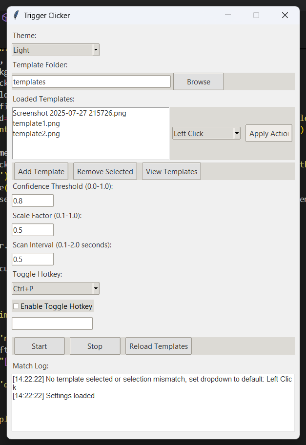

# Trigger Clicker

**Trigger Clicker** is a Python-based automation tool that detects on-screen images and performs specified mouse click actions (`Left Click`, `Right Click`, or `Double Click`) at their locations. Using [OpenCV](https://opencv.org/) for image recognition, it matches user-defined template images against the screen in real-time, making it ideal for automating repetitive tasks in safe, non-competitive environments. The tool features a user-friendly Tkinter GUI with light/dark themes, customizable hotkeys, and persistent settings.

## Features

- **Image-Based Automation**: Detects template images on the screen and performs user-specified mouse clicks (`Left Click`, `Right Click`, `Double Click`).
- **User-Friendly GUI**: Manage templates, adjust settings, and monitor actions via a Tkinter interface with light and dark themes.
- **Template Management**: Add, remove, and preview template images (supports `PNG`, `JPG`, `JPEG`, `BMP` formats).
- **Customizable Click Actions**: Assign `Left Click`, `Right Click`, or `Double Click` to each template via a dropdown and apply changes instantly.
- **Hotkey Support**: Toggle pause/resume with predefined hotkeys (e.g., `Ctrl+P`, `F1`) or custom hotkeys (e.g., `ctrl+shift+a`, `f5`).
- **Adjustable Parameters**:
  - Confidence threshold (`0.0–1.0`) for image matching accuracy.
  - Scale factor (`0.1–1.0`) for template resizing.
  - Scan interval (`0.1–2.0` seconds) for detection frequency.
- **Real-Time Logging**: View detailed logs of template matches, click actions, and settings changes.
- **Persistent Settings**: Save template folder, click actions, hotkeys, and other settings to a `triggerclicker_settings.json` file.
- **Multi-Threaded Processing**: Uses `ThreadPoolExecutor` for efficient parallel template matching.

## Screenshot

- 

## Requirements

The following Python libraries are required to run Trigger Clicker:

```bash
opencv-python
pyautogui
numpy
pillow
keyboard
```

Additionally, `tkinter` is required (usually included with Python, but may need `python3-tk` on Linux).

## Installation

1. **Clone the Repository**:
   ```bash
   git clone https://github.com/your-username/trigger-clicker.git
   cd trigger-clicker
   ```

2. **Install Dependencies**:
   Create a virtual environment (optional) and install the required libraries:
   ```bash
   python -m venv venv
   source venv/bin/activate  # On Windows: venv\Scripts\activate
   pip install -r requirements.txt
   ```

3. **Prepare Template Images**:
   - Create a `templates` folder in the project directory.
   - Add images (`PNG`, `JPG`, `JPEG`, or `BMP`) to use as templates for detection (e.g., UI buttons, icons).

4. **Run the Script**:
   Run Trigger Clicker with Python (use administrator privileges on Windows for hotkey support):
   ```bash
   python trigger_clicker.py
   ```

   > **Note**: On Windows, run the terminal as administrator if hotkeys (via the `keyboard` library) fail to register.

## Usage

1. **Launch the GUI**:
   Run `trigger_clicker.py` to open the GUI.

2. **Configure Template Folder**:
   - Click **Browse** to select a folder containing template images or use the default `templates` folder.
   - Click **Reload Templates** to load images from the selected folder.

3. **Manage Templates**:
   - **Add Template**: Select an image file and choose a click action (`Left Click`, `Right Click`, `Double Click`) from the dropdown.
   - **Remove Selected**: Select a template in the listbox and click to remove it.
   - **View Templates**: Preview loaded templates with their assigned click actions.

4. **Set Click Actions**:
   - Select a template in the listbox (e.g., `button.png`).
   - Choose a click action (`Left Click`, `Right Click`, `Double Click`) from the dropdown.
   - Click **Apply Action** to assign the action to the template.
   - Verify the action in the **View Templates** window or log.

5. **Configure Hotkeys**:
   - Select a hotkey from the dropdown (`Ctrl+P`, `Ctrl+S`, `Ctrl+Q`, `F1`, `F2`, `F3`, or `Custom`).
   - For `Custom`, enter a valid hotkey (e.g., `ctrl+shift+a`, `f5`) in the text field.
   - Check **Enable Toggle Hotkey** to activate the hotkey for pausing/resuming the clicker.

6. **Adjust Parameters**:
   - **Confidence Threshold** (`0.0–1.0`): Set the minimum match accuracy for template detection.
   - **Scale Factor** (`0.1–1.0`): Adjust template size for faster or more accurate matching.
   - **Scan Interval** (`0.1–2.0` seconds): Set the frequency of screen scans.

7. **Start/Stop the Clicker**:
   - Click **Start** to begin scanning for templates and performing click actions.
   - Click **Stop** to halt the process.
   - Use the configured hotkey to toggle pause/resume during operation.

8. **Monitor Logs**:
   - View real-time logs for template matches, click actions, and settings changes in the GUI’s log window.

9. **Save Settings**:
   - Settings (template folder, click actions, hotkeys, etc.) are automatically saved to `triggerclicker_settings.json` when closing the GUI.

## Example Workflow

1. Place a button image (`button.png`) in the `templates` folder.
2. Launch Trigger Clicker and load the `templates` folder.
3. Select `button.png` in the listbox, choose `Right Click` from the dropdown, and click **Apply Action**.
4. Set a custom hotkey (e.g., `ctrl+shift+a`) and enable it.
5. Click **Start** to begin scanning. When `button.png` is detected on-screen, Trigger Clicker performs a right-click at its center.
6. Use `ctrl+shift+a` to pause/resume the clicker.
7. Check the log for messages like:
   ```text
   [14:00:00] Match found for button.png: confidence=0.85
   [14:00:00] Right Click on button.png at (x, y)
   ```

## Ethical Use

Trigger Clicker is designed for automating tasks in permitted, non-competitive environments (e.g., offline applications, personal workflows). **Do not use this tool in online games**, competitive settings, or any application where automation violates terms of service. Misuse may result in account bans or other consequences. Always respect the rules of the software you are automating.

## Contributing

Contributions are welcome! To contribute:
1. Fork the repository.
2. Create a feature branch:
   ```bash
   git checkout -b feature/new-feature
   ```
3. Commit your changes:
   ```bash
   git commit -m "Add new feature"
   ```
4. Push to the branch:
   ```bash
   git push origin feature/new-feature
   ```
5. Open a pull request.

Please include clear descriptions and test your changes thoroughly.

## License

This project is licensed under the MIT License.

## Acknowledgments

- Built with [OpenCV](https://opencv.org/) for image recognition, [PyAutoGUI](https://pyautogui.readthedocs.io/) for mouse control, and [Tkinter](https://docs.python.org/3/library/tkinter.html) for the GUI.
- Hotkey functionality powered by [keyboard](https://github.com/boppreh/keyboard).
- Thanks to the Python community for excellent libraries and documentation.
